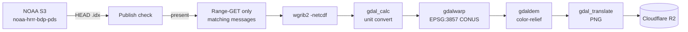

# storm-spotter-models-renderer

Public GitHub Actions pipeline that decodes NOAA HRRR, NAM, RRFS, GFS and
ECMWF IFS open-data GRIB2 forecast
data, color-relieves it to PNG tiles, and uploads them to Cloudflare R2 for
the **Storm Spotter Tools Pro** Flutter app to consume.

The whole pipeline costs $0/month: public-repo runners are unmetered, NOAA
S3 buckets are free to read, and Cloudflare R2 has a 10 GB free tier with
zero egress fees.

## What gets rendered

| Model | Products | Forecast range | Frame count |
|-------|----------|----------------|-------------|
| **HRRR** (3 km, hourly) | refc, t2m, td2m, wind10m, gust10m, mslp, sfccape, precip1h | f00–f18 (f00–f48 on 00/06/12/18Z) | 19 / 49 |
| **RRFS** (3 km, hourly) | refc, t2m, td2m, wind10m, gust10m, mslp, sfccape, precip1h, precipTotal | f00–f18 (f00–f84 on 00/06/12/18Z) | 19 / 85 |
| **NAM** (3 km nest, 4×/day) | refc, t2m, td2m, wind10m, gust10m, mslp, sfccape, precip3h | f00–f60 hourly (precip3h every 3h) | 61 |
| **GFS** (0.25°, 4×/day) | refc, t2m, wind500, mslp, precipTotal | f00–f120 at 3h step | 41 |
| **ECMWF** (0.25°, 2×/day) | capeMU, t2m, td2m, wind10m, gust10m, mslp, precipTotalM, wind500 | f00–f144 at 3h step | 49 |

ECMWF frames come from [ECMWF IFS open data](https://www.ecmwf.int/en/forecasts/datasets/open-data)
(CC-BY-4.0 — contains modified ECMWF IFS open data).

ICON-D2 frames are rendered from the [Open-Meteo database on AWS Open Data](https://github.com/open-meteo/open-data)
(CC-BY-4.0 — weather data by Open-Meteo.com; underlying model © DWD, CC-BY-4.0).
This is the `openmeteo_spatial` source type: whole `.om` files per valid time
decoded locally via `scripts/om_extract.py` instead of GRIB idx byte-ranges.

Last 5 runs per model are retained on R2. Storage envelope ≈ 360 MB.

## URL shape on R2

```
https://models.<your-domain>/v1/<model>/<product>/<RUN_YYYYMMDDHH>/F<HHH>.png
https://models.<your-domain>/v1/<model>/manifest.json
```

## Setup

**This is a one-time, ~30-minute setup.** Follow [CLOUDFLARE_SETUP.md](CLOUDFLARE_SETUP.md)
in order. It walks you through:

1. Creating a Cloudflare account
2. Creating an R2 bucket + API token
3. Adding your domain to Cloudflare (with Squarespace nameserver migration steps)
4. Connecting the R2 bucket to your custom subdomain
5. Adding the four required secrets to this GitHub repo

Once the secrets are set, the workflows fire on cron automatically. To verify:

```bash
# In the repo on GitHub → Actions → "Render HRRR" → Run workflow
# Watch the run log; you should see PNG uploads to R2.
# Then open in browser:
#   https://models.<your-domain>/v1/HRRR/refc/<latest_run>/F000.png
```

## Layout

```
.github/workflows/
  render_hrrr.yml          # cron: every 15 min
  render_rrfs.yml          # cron: every 15 min (staggered +5 from HRRR)
  render_gfs.yml           # cron: every hour
scripts/
  decode_pipeline.sh       # core: HEAD .idx → byte-range GET → wgrib2 → gdal → PNG → R2
  render_hrrr.sh           # iterates HRRR forecast hours × products
  render_rrfs.sh           # same sweep for RRFS (pre-operational rrfs_a feed)
  render_gfs.sh            # iterates GFS forecast hours × products
  build_manifest.py        # rebuilds v1/<model>/manifest.json
  prune_old_runs.py        # trims R2 to last N runs per product
config/
  products.yml             # canonical product catalog
  color_tables/*.clr       # gdaldem color ramps (NWS-standard)
```

## How a single frame is produced



Single message → ~200 KB of GRIB → 1024×1024 PNG ≈ 200 KB.

## Upgrade path (not implemented v1)

Cron-based polling can be replaced with NOAA's SNS topic for true real-time:
1. Subscribe a Cloudflare Worker to `arn:aws:sns:us-east-1:709902155096:NewHRRRObject`.
2. Worker fires GitHub `repository_dispatch` webhook on object publish.
3. `render_hrrr.yml` adds `repository_dispatch` trigger alongside `schedule`.

Same $0/mo (Workers free tier covers it). Frames go live within ~30 sec of NOAA publish instead of up to 15 min behind.

## Local development

```bash
# Install deps (Ubuntu/WSL):
sudo apt-get install wgrib2 gdal-bin python3-gdal
pip3 install PyYAML
curl -s https://rclone.org/install.sh | sudo bash
sudo curl -sSfL -o /usr/local/bin/yq \
  https://github.com/mikefarah/yq/releases/latest/download/yq_linux_amd64
sudo chmod +x /usr/local/bin/yq

# Configure rclone with your R2 creds:
rclone config  # follow prompts, name the remote "r2"

# Render a single frame end-to-end:
export R2_BUCKET=storm-spotter-models
bash scripts/decode_pipeline.sh HRRR refc 20260522 18 6
```

## Cost monitoring

Check the Cloudflare R2 dashboard weekly for the first month:
- Storage should stay under 500 MB
- Class A ops < 50k/day
- Egress: always $0 on R2

If storage creeps up: drop retention from 5 → 3 runs in `config/products.yml`,
or reduce HRRR f48 → f18 on synoptic runs.

## License

MIT — see [LICENSE](LICENSE).
